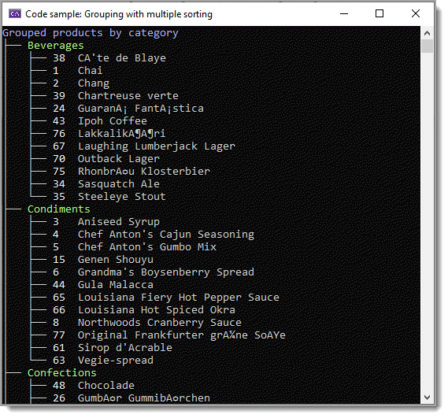
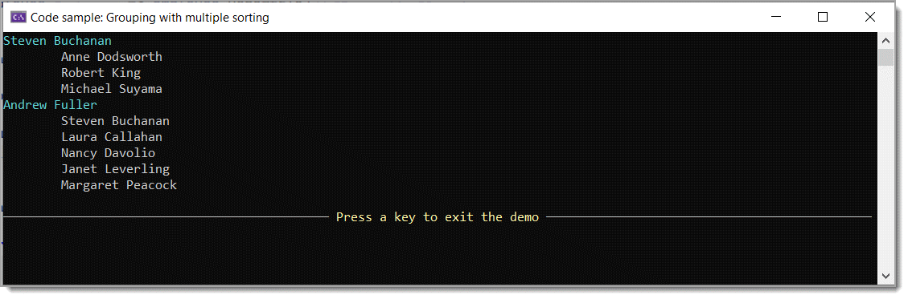
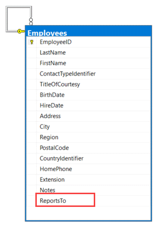

# About

Using EF Core 6, NorthWind database group products by categories, order by category name followed by products within each category group



```csharp
List<List<Products>> groupedCategories = context.Products
    .Include(p => p.Category)
    .ToList()
    .OrderBy(p => p.Category.CategoryName)
    .ThenBy(p => p.ProductName)
    .GroupBy(p => p.CategoryId)
    .Select(g => g.ToList())
    .ToList();
```

Using EF Core 6, NorthWind database, self referencing employees table, group by a column `ReportsTo`




<br>



```csharp
List<Employees> employees = context.Employees.ToList();

List<IGrouping<int?, Employees>> groupedData = employees
    .Where(employee => employee.ReportsTo.HasValue)
    .ToList()
    .OrderBy(employee => employee.LastName)
    .GroupBy(employee => employee.ReportsTo)
    .ToList();
```