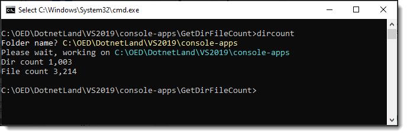
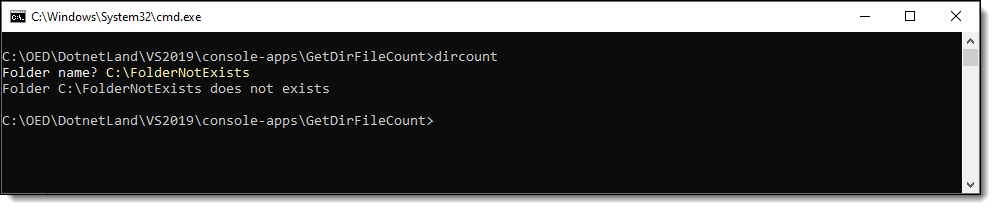

# About

Example to get from a valid folder path, count of folders and count of all files recursively.

From the command prompt type `dircount`, enter a folder name, press <kbd>enter</kbd>.



Now try with a non-existing folder




:small_orange_diamond:
Here there is a prompt for the folder name rather than command arguments for command arguments see `Greetings` project.

```csharp
[Option("-f|--folder")]
```

</br>
Directory code comes from this [repository](https://github.com/karenpayneoregon/iterate-files-directories).


# Install/uninstall

1. Build the project
1. Open a command prompt to the root of this project
1. Enter `dotnet tool install --global --add-source ./nupkg GetDirFileCount` to install the tool
1. Enter `dotnet tool uninstall -g getdirfilecount` to uninstall the tool.

# Groupby

Here we traverse an entire folder structure, group by each folder and get file count for each. Note this method has a companion method which uses a try-catch in the event a folder structure may have permission issues.

```csharp
public static (int directoryCount, int fileCount) DirectoryFileCount(string directory, SearchOption searchOption)
{
    Dictionary<bool, int> dictionary = new DirectoryInfo(directory)
        .EnumerateFileSystemInfos("*", searchOption)
        .GroupBy(fsi => fsi is DirectoryInfo)
        .ToDictionary(item => item.Key, s => s.Count());

    return (dictionary.ContainsKey(true) ? dictionary[true] : 0, dictionary.ContainsKey(false) ? dictionary[false] : 0);
}
```

