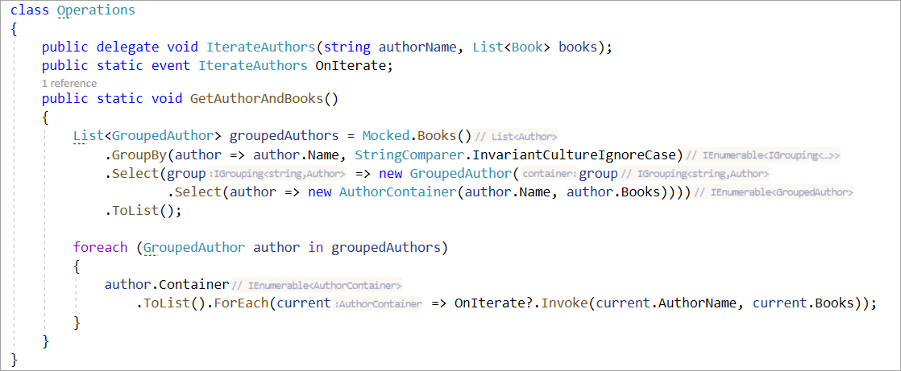

# About

Complex GroupBy case insensitive



```csharp
class Operations
{
    public delegate void IterateAuthors(string authorName, List<Book> books);
    public static event IterateAuthors OnIterate;
    public static void GetAuthorAndBooks()
    {
        List<GroupedAuthor> groupedAuthors = Mocked.Books()
            .GroupBy(author => author.Name, StringComparer.InvariantCultureIgnoreCase)
            .Select(group => new GroupedAuthor(group
                    .Select(author => new AuthorContainer(author.Name, author.Books))))
            .ToList();
        
        foreach (GroupedAuthor author in groupedAuthors)
        {
            author.Container
                .ToList().ForEach(current => OnIterate?.Invoke(current.AuthorName, current.Books));
        }
    }
}
```
