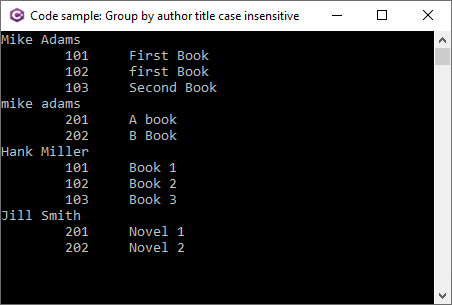
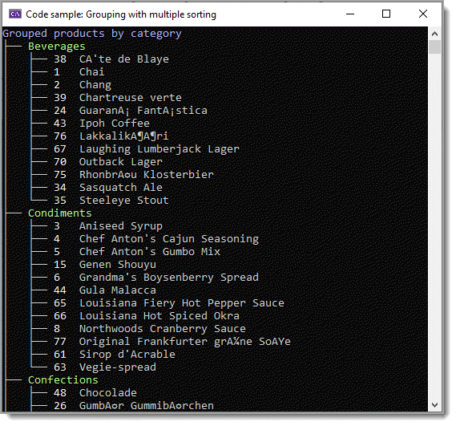

# Basic to intermediate grouping with C#

Learn the basics of grouping data with models and DataTable. 

Rather than get extremely complex, most of the examples are simple for learning purposes. Best way to learn from these code samples is start with those starting with Sample with a number, so start with Sample1 and run through to Sample5. 

Run each project one at a time, look at the results then go back and step through the code with Visual Studio’s debugging and examine data in Visual Studio’s local window.

Once these samples make sense do the same for projects under the Advance Solution Explorer folder. Run, go back and study the code.

By understanding all the code samples provides a base for more advance group by operations.

**Note** Other than the project `GroupByMultipleProperties` all other examples rerquire no database while `GroupByMultipleProperties` requires SQL-Server as this project uses Entity Framework Core.

One of several code samples



```csharp
partial class Program
{
    static void Main(string[] args)
    {
        var grouped = Mock.Books()
            .GroupBy(group => group.AuthorName)
            .Select(grouping => new AuthorListing(grouping.Key, grouping.ToList()
                .Select(book => book.Titles.ToList())))
            .ToList();

        foreach (AuthorListing listing in grouped)
        {
            Console.WriteLine(listing.Author);
            foreach (var title in listing.Titles)
            {
                Console.WriteLine($"\t{title}");
            }

            Console.WriteLine();

        }

        Console.ReadLine();
    }
}
```


Another using EF Core 6

